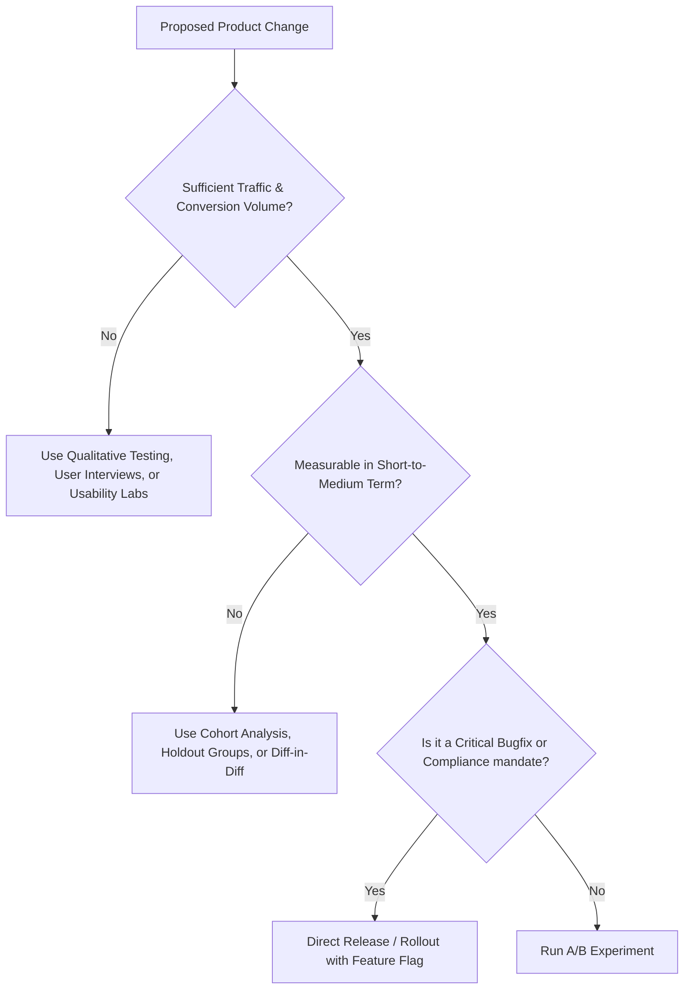
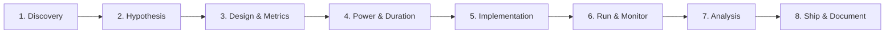

# Comprehensive A/B Testing Guide: From Foundations to Advanced Experimentation

A complete, end-to-end guide to designing, executing, analyzing, and scaling A/B tests and experimentation programs for digital products, web platforms, and engineering teams.

---

## Table of Contents

1. [Introduction to A/B Testing](#1-introduction-to-ab-testing)
   - [What is A/B Testing?](#what-is-ab-testing)
   - [Types of Experimentation (A/B, A/B/n, MVT, Multi-Armed Bandit)](#types-of-experimentation)
   - [When to Use A/B Testing (and When Not To)](#when-to-use-ab-testing)
2. [The End-to-End Experimentation Lifecycle](#2-the-end-to-end-experimentation-lifecycle)
   - [Phase 1: Discovery & Problem Identification](#phase-1-discovery--problem-identification)
   - [Phase 2: Hypothesis Formulation & Prioritization](#phase-2-hypothesis-formulation--prioritization)
   - [Phase 3: Experiment Design & Metric Architecture](#phase-3-experiment-design--metric-architecture)
   - [Phase 4: Sample Size Calculation & Duration Planning](#phase-4-sample-size-calculation--duration-planning)
   - [Phase 5: Technical Implementation & Telemetry](#phase-5-technical-implementation--telemetry)
   - [Phase 6: Execution & Health Monitoring](#phase-6-execution--health-monitoring)
   - [Phase 7: Statistical Analysis & Decision Making](#phase-7-statistical-analysis--decision-making)
   - [Phase 8: Post-Test Rollout & Institutional Learning](#phase-8-post-test-rollout--institutional-learning)
3. [Statistical Foundations for Experimentation](#3-statistical-foundations-for-experimentation)
   - [Hypothesis Testing ($H_0$ vs $H_1$)](#hypothesis-testing-h_0-vs-h_1)
   - [Type I Error ($\alpha$) & Significance Level](#type-i-error-alpha--significance-level)
   - [Type II Error ($\beta$) & Statistical Power ($1-\beta$)](#type-ii-error-beta--statistical-power-1-beta)
   - [Minimum Detectable Effect (MDE)](#minimum-detectable-effect-mde)
   - [Frequentist vs. Bayesian Approaches](#frequentist-vs-bayesian-approaches)
   - [Sample Size Formulas](#sample-size-formulas)
   - [Multiple Testing Problem & Corrections](#multiple-testing-problem--corrections)
4. [Metric Architecture](#4-metric-architecture)
   - [Primary (North Star) Metrics](#primary-north-star-metrics)
   - [Secondary / Explanatory Metrics](#secondary--explanatory-metrics)
   - [Guardrail / Health Metrics](#guardrail--health-metrics)
   - [Ratio & Non-Normal Metrics (Bootstrap / Delta Method)](#ratio--non-normal-metrics)
5. [Common Pitfalls & How to Mitigate Them](#5-common-pitfalls--how-to-mitigate-them)
   - [The Peeking Problem (Optional Stopping)](#the-peeking-problem-optional-stopping)
   - [Sample Ratio Mismatch (SRM)](#sample-ratio-mismatch-srm)
   - [Novelty and Primacy Effects](#novelty-and-primacy-effects)
   - [Simpson's Paradox](#simpsons-paradox)
   - [Seasonality & Day-of-Week Bias](#seasonality--day-of-week-bias)
   - [Spillover & Network Effects](#spillover--network-effects)
6. [Engineering & Architecture Patterns](#6-engineering--architecture-patterns)
   - [Client-Side vs. Server-Side vs. Edge Experimentation](#client-side-vs-server-side-vs-edge-experimentation)
   - [Deterministic Bucketing (Hashing Algorithms)](#deterministic-bucketing-hashing-algorithms)
   - [Feature Flags & Kill Switches](#feature-flags--kill-switches)
   - [Instrumentation & Event Pipeline](#instrumentation--event-pipeline)
   - [Code Example: Deterministic Bucketing Engine](#code-example-deterministic-bucketing-engine)
7. [Prioritization Frameworks (ICE, RICE, PIE)](#7-prioritization-frameworks-ice-rice-pie)
8. [Practical Templates & Checklists](#8-practical-templates--checklists)
   - [Hypothesis Creation Template](#hypothesis-creation-template)
   - [Pre-Launch Checklist](#pre-launch-checklist)
   - [Post-Experiment Decision Matrix](#post-experiment-decision-matrix)

---

## 1. Introduction to A/B Testing

### What is A/B Testing?
**A/B testing** (or split testing) is a controlled randomized scientific experiment where two or more variants of a page, workflow, algorithm, or feature are shown to users at random. By comparing the performance of Variant A (the Control) against Variant B (the Treatment) across predefined metrics, teams can infer causal relationships between product changes and user behavior.

```
                  ┌───────────────► Variant A (Control)   ───► 5.2% Conversion
                  │ (50% Traffic)
All Eligible Users┤
                  │ (50% Traffic)
                  └───────────────► Variant B (Treatment) ───► 6.8% Conversion (+30.7%)*
                                                               *Statistically Significant
```

### Types of Experimentation

| Experiment Type | Description | Best Used When | Pros & Cons |
| :--- | :--- | :--- | :--- |
| **A/B Test** | Single variable comparison between baseline and 1 variant. | Testing focused UI tweaks, copy, single CTAs, or backend algorithms. | **+** Simple to isolate causality.<br>**-** Tests only one hypothesis at a time. |
| **A/B/n Test** | Baseline compared against multiple alternative variants (A vs B vs C vs D). | Multiple viable design or pricing iterations exist. | **+** Faster comparison across variations.<br>**-** Requires larger sample size to prevent power loss. |
| **Multivariate (MVT)** | Multiple combinations of different page elements tested simultaneously (e.g., 2 headlines $\times$ 2 buttons = 4 variants). | Highly optimized, high-traffic pages (checkout, landing pages) to find interaction effects. | **+** Uncovers interaction effects.<br>**-** Exponential traffic requirements. |
| **Multi-Armed Bandit (MAB)** | Adaptive algorithm (e.g., Thompson Sampling, Epsilon-Greedy) routing more traffic dynamically to winning variants during the test. | Short-lived campaigns (Black Friday, flash sales), ad headlines, news recommendations. | **+** Minimizes regret (lost conversions).<br>**-** Higher risk of false positives, obscures long-term causal inference. |

### When to Use A/B Testing



---

## 2. The End-to-End Experimentation Lifecycle



### Phase 1: Discovery & Problem Identification
Analyze existing behavior using quantitative and qualitative data:
- **Analytics & Funnel Analysis:** Where are users dropping off?
- **Heatmaps & Session Replays:** Are users struggling to find key actions or encountering rage clicks?
- **User Feedback / Support Tickets:** What confusion or friction is repeatedly reported?

### Phase 2: Hypothesis Formulation & Prioritization
Every experiment must test a clear, falsifiable hypothesis.

$$\text{Hypothesis} = \text{Observation} + \text{Proposed Solution} + \text{Expected Outcome} + \text{Underlying Rationale}$$

### Phase 3: Experiment Design & Metric Architecture
Define:
1. **Target Population:** (e.g., New users on Mobile Safari in North America).
2. **Unit of Randomization:** User ID (logged-in), Anonymous Cookie / Device ID, or Session ID.
3. **Primary Metric:** The decision criteria.
4. **Guardrail Metrics:** Performance, error rates, cancellations, latency.

### Phase 4: Sample Size Calculation & Duration Planning
- Pre-determine minimum sample size per variant based on baseline conversion, Minimum Detectable Effect (MDE), statistical power ($80\%$), and significance level ($\alpha = 0.05$).
- **Minimum Test Duration:** At least 1–2 full business cycles (e.g., 7 or 14 full days) to account for day-of-week seasonality.

### Phase 5: Technical Implementation & Telemetry
- Implement variants behind feature flags.
- Verify logging: ensure exposure events fire **only when the user actually experiences the treatment** (Avoid Intention-to-Treat dilution).

### Phase 6: Execution & Health Monitoring
- Daily checks for **Sample Ratio Mismatch (SRM)**.
- Monitor guardrails for performance regressions or crash spikes.
- **Do not stop early** just because a p-value is temporarily $< 0.05$ (avoids peeking bias).

### Phase 7: Statistical Analysis & Decision Making
- Evaluate primary metric at the scheduled sample size.
- Compute confidence intervals.
- Check secondary and guardrail metrics.

### Phase 8: Post-Test Rollout & Institutional Learning
- If winning: 100% rollout, clean up feature flag code and dead paths.
- If losing or inconclusive: Document why the hypothesis failed; update product assumptions.

---

## 3. Statistical Foundations for Experimentation

### Hypothesis Testing ($H_0$ vs $H_1$)

- **Null Hypothesis ($H_0$):** There is no true difference in performance between Variant A and Variant B ($\mu_B - \mu_A = 0$). Any observed difference is due to random sampling variation.
- **Alternative Hypothesis ($H_1$):** There is a real, non-zero difference between Variant A and Variant B ($\mu_B - \mu_A \neq 0$ for two-tailed, or $\mu_B > \mu_A$ for one-tailed).

### Type I Error ($\alpha$) & Significance Level
- **Type I Error (False Positive):** Concluding that a difference exists when in reality it does not (detecting a "winner" that is just noise).
- Standard $\alpha = 0.05$ (5% threshold), corresponding to a **95% Confidence Level**.
- **$p$-value:** The probability of observing a result at least as extreme as the observed data, assuming the null hypothesis is true. If $p < \alpha$, we reject $H_0$.

### Type II Error ($\beta$) & Statistical Power ($1-\beta$)
- **Type II Error (False Negative):** Failing to detect a true difference when one actually exists (missing a real winner).
- Standard $\beta = 0.20$, which yields a **Statistical Power of 80%** ($1 - 0.20 = 0.80$).
- High power prevents underpowered tests that falsely declare promising features as "flat/inconclusive".

### Error Matrix

| Reality \ Decision | Conclude $H_0$ (No Effect) | Conclude $H_1$ (Effect Exists) |
| :--- | :--- | :--- |
| **$H_0$ is True (No Real Effect)** | Correct Decision ($1 - \alpha = 95\%$) | **Type I Error ($\alpha$, False Positive)** |
| **$H_1$ is True (Real Effect Exists)** | **Type II Error ($\beta$, False Negative)** | Correct Decision / Power ($1 - \beta = 80\%$) |

### Minimum Detectable Effect (MDE)
The smallest relative or absolute lift that the experiment has sufficient statistical power ($80\%$) to detect.
- Smaller MDE $\rightarrow$ Requires dramatically larger sample sizes.
- Sample size scales inversely with the square of the effect size:

$$N \propto \frac{1}{\text{MDE}^2}$$

### Frequentist vs. Bayesian Approaches

```
┌──────────────────────────────────────────────┬──────────────────────────────────────────────┐
│ Frequentist                                  │ Bayesian                                     │
├──────────────────────────────────────────────┼──────────────────────────────────────────────┤
│ • Relies on fixed sample sizes and p-values. │ • Incorporates prior belief distributions.   │
│ • Question answered: "What is the            │ • Question answered: "What is the            │
│   probability of seeing this data if there   │   probability that B is better than A given  │
│   is no difference?"                         │   the data?"                                 │
│ • Strict stopping rules; vulnerable to       │ • Natural interpretation; allows continuous  │
│   peeking if unadjusted.                     │   updating and expected loss calculations.   │
└──────────────────────────────────────────────┴──────────────────────────────────────────────┘
```

### Sample Size Formulas

For standard two-sample proportion test with equal allocation ($50/50$), baseline conversion rate $p_1$, target conversion rate $p_2$, and relative lift $\delta = \frac{p_2 - p_1}{p_1}$:

$$n_{\text{per variant}} = \frac{2 \cdot \left( Z_{1-\alpha/2} + Z_{1-\beta} \right)^2 \cdot \bar{p}(1-\bar{p})}{(p_2 - p_1)^2}$$

Where:
- $Z_{1-\alpha/2} = 1.96$ (for $\alpha = 0.05$, two-tailed)
- $Z_{1-\beta} = 0.84$ (for $80\%$ power)
- $\bar{p} = \frac{p_1 + p_2}{2}$

---

## 4. Metric Architecture

A robust experiment relies on a three-tier metric hierarchy:

```
                  ┌───────────────────────────────┐
                  │    Primary (North Star)       │
                  │   Direct measure of goal      │
                  └───────────────┬───────────────┘
                                  │
                  ┌───────────────▼───────────────┐
                  │          Secondary            │
                  │ Diagnostic & funnel steps     │
                  └───────────────┬───────────────┘
                                  │
                  ┌───────────────▼───────────────┐
                  │          Guardrail            │
                  │  Latency, Errors, Revenue     │
                  └───────────────────────────────┘
```

### 1. Primary Metrics
- The single metric that determines whether the hypothesis is proven.
- *Examples:* Sign-up completion rate, Checkout conversion rate, 7-day retention.

### 2. Secondary Metrics
- Intermediate steps in the funnel to explain **why** the primary metric changed.
- *Examples:* CTA click-through rate (CTR), Form field completion rate, Time-on-page.

### 3. Guardrail Metrics
- Business and operational health checks that must **not** degrade.
- *Examples:* Page load time (P95/P99), Error/Crash rate, Support ticket volume, Unsubscribe rate, Average Revenue per User (ARPU).

---

## 5. Common Pitfalls & How to Mitigate Them

### The Peeking Problem (Optional Stopping)
- **Problem:** Continuously checking $p$-values and stopping the test as soon as $p < 0.05$ inflates the false positive rate from $5\%$ up to $30\%\text{--}40\%$.
- **Mitigation:** Pre-commit to a sample size/duration before launch, or use sequential testing frameworks (e.g., mSPRT - Mixture Sequential Probability Ratio Test, or Alpha Spending functions).

### Sample Ratio Mismatch (SRM)
- **Problem:** When the observed ratio of traffic (e.g., 47,000 vs 53,000) deviates significantly from the planned allocation ($50/50$).
- **Cause:** Technical bugs, redirect latency, bot filtering differences, or caching issues.
- **Detection:** Run a Chi-Square Goodness-of-Fit test on sample counts:

$$\chi^2 = \sum \frac{(O_i - E_i)^2}{E_i}$$

If $p < 0.001$, the experiment is invalid and contaminated; results should **not** be trusted.

### Novelty and Primacy Effects
- **Novelty Effect:** Existing users interact with a new design purely because it is new, creating an artificial initial lift that decays over time.
- **Primacy Effect:** Existing users resist a change because they are accustomed to the old layout, creating an initial drop.
- **Mitigation:** Segment analysis between **New vs. Existing users** and run tests long enough (2–4 weeks) for behavior to stabilize.

### Simpson's Paradox
- An aggregate trend appears in combined data but disappears or reverses when partitioned into subgroups (e.g., Desktop vs. Mobile) due to unequal traffic shifts.
- **Mitigation:** Always use stratified randomization or review weighted subgroup segments.

---

## 6. Engineering & Architecture Patterns

### Client-Side vs. Server-Side vs. Edge

```
+------------------+----------------------------------+----------------------------------+
| Approach         | Advantages                       | Disadvantages                    |
+------------------+----------------------------------+----------------------------------+
| Client-Side      | • Quick implementation           | • Layout shift (FOUC / flicker)  |
| (Browser DOM)    | • Great for non-technical teams  | • Performance overhead           |
|                  | • Simple copy & style changes    | • Security / payload exposure    |
+------------------+----------------------------------+----------------------------------+
| Server-Side      | • Zero layout shift (FOUC)       | • Requires engineering sprint    |
| (API / Backend)  | • Secure (business logic hidden) | • Slower iteration cycle         |
|                  | • Supports complex workflows     |                                  |
+------------------+----------------------------------+----------------------------------+
| Edge / CDN       | • Ultra-low latency (<10ms)      | • Edge compute costs             |
| (Workers/Lambda) | • Zero flicker                   | • Limited database context       |
+------------------+----------------------------------+----------------------------------+
```

### Deterministic Bucketing Engine
To ensure a user always receives the exact same variant across sessions without needing persistent database lookups, use consistent hashing (e.g., MurmurHash3 or MD5 with a salt/seed).

```typescript
/**
 * Deterministic bucketing algorithm for A/B testing
 */
import { createHash } from 'crypto';

interface VariantAllocation {
  name: string;
  weight: number; // 0 to 100
}

export class ExperimentManager {
  /**
   * Deterministically assigns a user to a variant based on salt + userId
   */
  public static getVariant(
    experimentKey: string,
    userId: string,
    variants: VariantAllocation[]
  ): string {
    // Generate uniform hash between 0 and 99
    const hashInput = `${experimentKey}:${userId}`;
    const hashHex = createHash('sha256').update(hashInput).digest('hex');
    const hashInt = parseInt(hashHex.substring(0, 8), 16);
    const bucket = hashInt % 100; // 0 - 99

    let cumulativeWeight = 0;
    for (const variant of variants) {
      cumulativeWeight += variant.weight;
      if (bucket < cumulativeWeight) {
        return variant.name;
      }
    }

    return variants[0].name; // Fallback to Control
  }
}

// Example Usage:
const variants: VariantAllocation[] = [
  { name: 'control', weight: 50 },
  { name: 'checkout_v2', weight: 50 }
];

const userVariant = ExperimentManager.getVariant('checkout_redesign_2026', 'user_98412', variants);
console.log(`User assigned to: ${userVariant}`);
```

---

## 7. Prioritization Frameworks (ICE, RICE, PIE)

When managing an experiment backlog, use a quantitative scoring framework:

### The RICE Framework

$$\text{RICE Score} = \frac{\text{Reach} \times \text{Impact} \times \text{Confidence}}{\text{Effort}}$$

- **Reach:** How many users will encounter this change in a given timeframe? (e.g., 50,000 users/month).
- **Impact:** Expected effect on target metric (3 = Massive, 2 = High, 1 = Medium, 0.5 = Low, 0.25 = Minimal).
- **Confidence:** How certain are you of the estimates? (100% = High data support, 80% = Medium support, 50% = Intuition/Moonshot).
- **Effort:** Person-weeks or story points required to design, build, QA, and analyze.

---

## 8. Practical Templates & Checklists

### Hypothesis Creation Template

```markdown
### Experiment Brief: [Feature / Experiment Name]

- **Status:** [Draft | Ready | Running | Concluded | Rolled Out]
- **Target Audience:** [e.g., All authenticated users on mobile devices]
- **Experiment Key:** `exp_pricing_cta_color_v1`

#### 1. Problem Statement & Observation
Analytics show a 42% drop-off at the final payment confirmation button on mobile devices.

#### 2. Hypothesis
**If we** make the checkout CTA sticky to the bottom of the viewport with a clear total price summary,
**Then** payment completion conversion will increase by at least 5% (relative),
**Because** users will not have to scroll past lengthy order summaries to reach the primary action.

#### 3. Metric Definition
- **Primary Metric:** Checkout completion rate (`payments_completed / checkout_views`)
- **Secondary Metrics:** Time to checkout completion, Cart abandonment rate
- **Guardrail Metrics:** Payment error rate, P95 checkout page latency, Customer support dispute rate

#### 4. Experiment Parameters
- Baseline Rate: 12.0%
- MDE (Relative): +5% (Target: 12.6%)
- Alpha ($\alpha$): 0.05
- Power ($1-\beta$): 0.80
- Required Sample Size per Variant: 48,200 users
- Estimated Duration: 14 days (2 full weekly cycles)
```

### Pre-Launch Checklist

- [ ] **Exposure Logging:** Exposure events trigger only when the treatment is rendered and visible.
- [ ] **Deterministic Allocation:** Verified that the same user ID receives the identical variant across repeated calls and across devices.
- [ ] **Cross-Browser & Device QA:** Tested across iOS, Android, Safari, Chrome, Firefox.
- [ ] **SRM Guard Ready:** Chi-Square test configured in analytics dashboard.
- [ ] **Guardrails Configured:** Latency, error rates, and business metrics alerts active.
- [ ] **Kill-Switch Tested:** Verified that disabling the flag immediately routes all users safely to Control without app restarts.

---

## Summary Cheat Sheet

| Step | Goal | Key Rule |
| :--- | :--- | :--- |
| **Formulate** | Create clear falsifiable hypothesis | Use: *If [change], then [impact], because [rationale]* |
| **Size** | Calculate required sample size upfront | Always fix sample size and duration (min 1–2 cycles) |
| **Implement** | Server-side / Edge bucketing | Log exposure only upon actual user impression |
| **Verify** | Check health during run | Run Chi-Square test for SRM; never peek and stop early |
| **Analyze** | Evaluate statistical significance | Check primary, secondary, and guardrail metrics |
| **Ship** | Roll out winning treatment | Remove flags, clean up tech debt, document takeaways |
