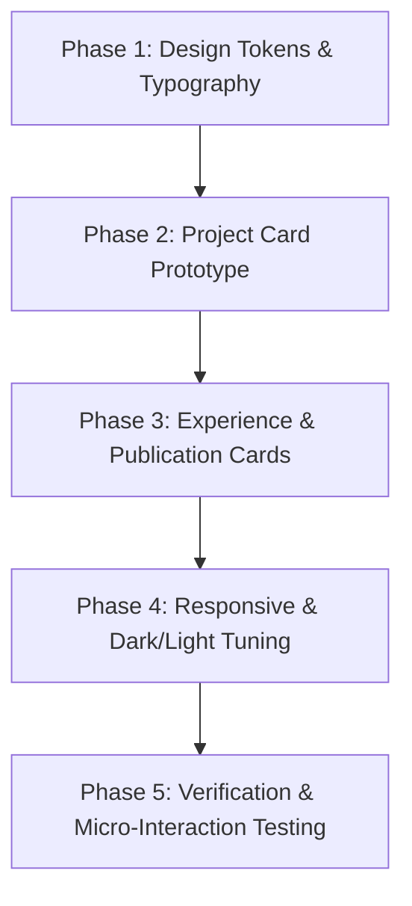

# Keyvo Website Design Analysis & Portfolio Card Redesign Plan

> **Reference:** [Keyvo Website on Dribbble (Shot 27214788)](https://dribbble.com/shots/27214788-Keyvo-Website) by **Heyo** / Kevin Bhagat  
> **Target:** Nafi Ahmed's Portfolio (`src/app/pages/projects`, `src/app/pages/experience`, `src/app/pages/publications`, `src/styles.scss`)  
> **Document Date:** September 2026

---

## 1. Executive Summary & Design Philosophy

Keyvo's digital design language—created by design agency **Heyo**—revolutionizes B2B SaaS in the vehicle subscription and financing sector. Rather than relying on generic corporate fintech templates or heavy, indistinguishable dark cards, Keyvo introduces **architectural modularity (Neo-Bento)**, precision data visualization, crisp typography pairings, and micro-structured content panels.

This document analyzes the exact design patterns, color systems, typography, card anatomy, and micro-interactions of the Keyvo website, and provides a comprehensive, component-by-component plan to revamp the portfolio card experience.

---

## 2. Deep-Dive Design Analysis of Keyvo

### 2.1 Color Palette & Atmosphere

Keyvo achieves an ultra-premium, modern tech feel using an organic high-contrast palette: deep evergreen, pure whites, soft mist grays, and electric mint accents:

| Token Name | Hex Code / Value | Usage in Keyvo |
| :--- | :--- | :--- |
| **Deep Forest (Base Dark)** | `#032304` / `#053005` | Hero backgrounds, primary text headings, dark containers |
| **Electric Mint (Primary Accent)** | `#17ee1a` / `#8bf78d` / `#0e8f10` | High-priority accents, active status dots, interactive hovers |
| **Mint Wash (Badge Background)** | `#c5fbc6` / `#e7fde8` / `#f3fef3` | Pill badges, highlighted card rows, selected state fills |
| **Pure Canvas (Card Surface)** | `#ffffff` | Primary card elevations, high-contrast foreground panels |
| **Mist Panel (Sub-surface)** | `#f8f9f8` / `#f7f8f6` | Inset visual displays, metric strip containers |
| **Slate Border (Fine Line)** | `#d4dad3` / `#e3e7e2` | 1px razor-sharp borders separating nested sub-panels |
| **Carbon Text (Primary)** | `#131413` | Headings, prominent metrics, card titles |
| **Muted Slate (Secondary Text)** | `#4a4e49` / `#939b92` | Subtitles, metric labels, inactive links |
| **Coral Alert (Secondary Status)** | `#f65366` / `#fdd4d9` | Risk alerts, negative deltas, Tier B/C indicators |

### 2.2 Typography System

Keyvo utilizes a tight, intentional pairing of modern geometric grotesk with monospaced data styling:

1. **Host Grotesk (`500`, `700`, `800`)**:
   - Primary display & UI typography.
   - Clean, geometric letterforms with tight tracking (`-0.01em` to `-0.02em`) on headings.
   - Expresses modern engineering elegance without sounding generic.
2. **Azeret Mono (`600`, `900`)**:
   - Used for numerical values, status badges (`BEST OPTION`, `TIER A`), VIN numbers, and metric counters.
   - Imparts a sense of cryptographic precision and data integrity.
3. **Inter / System Sans (`400`, `500`)**:
   - Neutral body copy and narrative descriptions for maximum readability.

### 2.3 Card Anatomy & Architecture (The Keyvo Formula)

In Keyvo, a "card" is never just a plain rectangle with vertically stacked text. Instead, it follows a **three-tier nested panel architecture**:

```
┌────────────────────────────────────────────────────────────┐
│ Keyvo Card Container (20px radius, 1px border, soft shadow) │
│                                                            │
│  ┌──────────────────────────────────────────────────────┐  │
│  │ 1. Inset Display Canvas                              │  │
│  │    - Sub-surface (#f7f8f6, 12px radius, 1px border)  │  │
│  │    - Visual showcase / preview illustration          │  │
│  │    - Primary title (e.g., "2024 Kia Telluride")      │  │
│  └──────────────────────────────────────────────────────┘  │
│                                                            │
│  ┌──────────────────────────────────────────────────────┐  │
│  │ 2. Metadata & Identity Row                           │  │
│  │    - [Icon Squircle] Title & Subtitle               │  │
│  │    - Status Capsule Pill: [● Active / BEST OPTION]   │  │
│  └──────────────────────────────────────────────────────┘  │
│                                                            │
│  ┌──────────────────────────────────────────────────────┐  │
│  │ 3. Segmented Metric Strip (3-Column Grid)            │  │
│  │    ┌──────────────┬──────────────┬────────────────┐  │  │
│  │    │ ● 97         │ $570.83      │ $100.00        │  │  │
│  │    │ Risk Score   │ Monthly Cost │ Profit Margin  │  │  │
│  │    └──────────────┴──────────────┴────────────────┘  │  │
│  └──────────────────────────────────────────────────────┘  │
└────────────────────────────────────────────────────────────┘
```

#### Key Micro-Details:
1. **Nested Radii Hierarchy:**
   - Outer card: `border-radius: 20px` to `24px`
   - Inset display panel: `border-radius: 12px` to `14px`
   - Metric strip: `border-radius: 10px` to `12px`
   - Status badge / tags: `border-radius: 999px` (capsule pill)
2. **Dividers:** Fine vertical lines (`1px solid var(--border-color)`) between metric columns instead of free-floating numbers.
3. **Status Dots:** Active colored dots (`w-2 h-2 rounded-full`) embedded right inside pills (`● Tier A`, `● Live Demo`).
4. **Elevation:** Extremely subtle, dispersed ambient shadow (`0 20px 40px -15px rgba(0,0,0,0.05)`) paired with crisp 1px borders, avoiding muddy heavy drop shadows.

---

## 3. Current Portfolio Assessment vs. Keyvo Style

| Feature | Current Portfolio Card (`projects.html`) | Keyvo-Inspired Card Paradigm |
| :--- | :--- | :--- |
| **Card Surface** | Uniform dark semi-transparent glass (`rgba(15,23,42,0.72)`) | Layered nested architecture (Outer card + inset sub-surface panels) |
| **Visual Preview** | FontAwesome icon inside small 52×52 box | Dedicated top visual canvas or interactive thumbnail display area |
| **Metrics & Data** | None (pure narrative description + badge pills) | Dedicated **Segmented Metric Strip** (e.g., Timeline, Impact/Stars, Category) |
| **Badges & Tags** | Simple rectangles with rounded 4px corners | Rounded capsule pills (`rounded-full`) with live status dot indicators (`●`) |
| **Typography** | Default sans-serif with standard weights | Geometric headings + Monospace badge accents (`Azeret Mono`) |
| **Dividers & Structure** | Free-form vertical flex layout | Structured modular sections separated by hairline hairline borders |

---

## 4. Portfolio Card Redesign Plan

> [!IMPORTANT]
> **Color Scheme Preservation Principle:**  
> Your portfolio’s existing brand identity and color scheme **will remain completely identical** after the redesign:
> * **Base & Surfaces:** Your deep navy/slate backgrounds (`--bg-base: #090d16`, `--bg-card: #131c2e`, `--bg-surface: #0e1424`) and light mode counterparts remain untouched.
> * **Brand Accents:** Your signature Indigo to Cyan gradients (`#6366f1` → `#06b6d4`), Cyan highlights (`#38bdf8`), and Emerald status colors (`#10b981`) remain intact.
> * **Dynamic Project Colors:** Each project's custom accent color (`project.color`) continues to drive its individual glow, icon tint, and interactive elements.
>
> We are **only adopting Keyvo's structural UX/UI architecture**: nested panel cards, 3-column segmented metric strips, capsule status pills with live dot indicators, and modern typography hierarchy.

### 4.1 Target Areas in Portfolio
1. **Project Cards** (`src/app/pages/projects/projects.html` & `.scss`): High-priority transformation into Keyvo-style feature cards with visual framing and impact metrics.
2. **Experience Cards** (`src/app/pages/experience/experience.html` & `.scss`): Segmented timeline cards with company emblem tile, role status pill, and duration metric strip.
3. **Publication Cards** (`src/app/pages/publications/publications.html` & `.scss`): Academic cards with citation counter, venue pill, and direct paper action button.

---

### 4.2 Project Card Redesign Specification

#### Visual Structure:
1. **Top Inset Preview Canvas:**
   - A dedicated display area inside the card (`background: rgba(255,255,255,0.03)` on dark mode, `border: 1px solid rgba(255,255,255,0.06)`).
   - Showcases project icon/screenshot or hero visual preview, with an animated hover subtle zoom.
   - Top right: quick-action icon buttons (GitHub, Live Demo, Play Store) floating cleanly with glass backdrop.
2. **Project Identity & Status Pill:**
   - Left: Project name with prominent title typography + short role descriptor.
   - Right: Capsule status badge with dot indicator (e.g. `● Production`, `● Open Source`, `● Featured`).
3. **Project Description & Tech Stack:**
   - 2-3 lines of clean description.
   - Pill badges for technologies (`rounded-full`, subtle border, hover highlight).
4. **Segmented Metric Bar (Keyvo Signature):**
   - 3-column structured bar at the bottom:
     - **Col 1:** Category / Type (`Mobile App`, `AI / ML`, `Web Platform`)
     - **Col 2:** Timeline / Role (`Lead Dev`, `2024-Present`)
     - **Col 3:** Impact / Key Metric (`10k+ DLs`, `Research Paper`, `Client MVP`)
5. **Interactive Footer Row:**
   - "Explore Project" text link with sliding chevron arrow (`→`) upon card hover.

---

### 4.3 Proposed HTML Template Structure (`projects.html`)

```html
<div class="keyvo-project-card glass-card reveal">
  <!-- 1. Top Inset Visual Canvas -->
  <div class="card-display-canvas">
    <div class="canvas-icon-wrapper" [style.background]="'rgba(' + hexToRgb(project.color) + ', 0.15)'">
      <i class="fa-solid" [ngClass]="project.icon" [style.color]="project.color"></i>
    </div>
    
    <!-- Floating Action Links -->
    <div class="canvas-actions">
      @if (project.github) {
        <a [href]="project.github" target="_blank" class="canvas-action-btn" title="GitHub">
          <i class="fa-brands fa-github"></i>
        </a>
      }
      @if (project.link) {
        <a [href]="project.link" target="_blank" class="canvas-action-btn" title="Live Demo">
          <i class="fa-solid fa-arrow-up-right-from-square"></i>
        </a>
      }
    </div>
  </div>

  <!-- 2. Header & Status Pill -->
  <div class="card-identity-row">
    <div class="identity-info">
      <h3 class="project-title">{{ project.name }}</h3>
      @if (project.shortRole) {
        <span class="project-role-caption">{{ project.shortRole }}</span>
      }
    </div>
    <div class="status-pill" [class.status-office]="project.category === 'office'">
      <span class="status-dot"></span>
      <span class="status-text">{{ project.category === 'office' ? 'Office' : 'Personal' }}</span>
    </div>
  </div>

  <!-- 3. Brief Description -->
  <p class="project-summary">{{ project.description }}</p>

  <!-- 4. Keyvo Signature Segmented Metrics Bar -->
  <div class="segmented-metric-strip">
    <div class="metric-cell">
      <span class="metric-value">{{ project.type }}</span>
      <span class="metric-label">Domain</span>
    </div>
    <div class="metric-divider"></div>
    <div class="metric-cell">
      <span class="metric-value">{{ project.tech[0] || 'Core' }}</span>
      <span class="metric-label">Primary Stack</span>
    </div>
    <div class="metric-divider"></div>
    <div class="metric-cell">
      <span class="metric-value highlight-accent" [style.color]="project.color">Active</span>
      <span class="metric-label">Status</span>
    </div>
  </div>

  <!-- 5. Tech Pills & Action Footer -->
  <div class="card-footer-row">
    <div class="tech-pill-cloud">
      @for (tech of project.tech.slice(0, 3); track tech) {
        <span class="keyvo-tech-tag">{{ tech }}</span>
      }
      @if (project.tech.length > 3) {
        <span class="keyvo-tech-tag tag-more">+{{ project.tech.length - 3 }}</span>
      }
    </div>
    <a [routerLink]="['/project', getSlug(project.name)]" class="keyvo-action-link">
      <span>Details</span>
      <i class="fa-solid fa-arrow-right link-arrow"></i>
    </a>
  </div>
</div>
```

---

### 4.4 SCSS Design System Specification (`projects.scss` / `styles.scss`)

```scss
/* ── Keyvo Neo-Bento Card System ─────────────────────────────────── */
.keyvo-project-card {
  display: flex;
  flex-direction: column;
  padding: 1.25rem;
  border-radius: 22px;
  background: var(--bg-card);
  border: 1px solid var(--border-color);
  box-shadow: 0 10px 30px -10px rgba(0, 0, 0, 0.35);
  transition: all 300ms cubic-bezier(0.16, 1, 0.3, 1);
  position: relative;
  overflow: hidden;

  &:hover {
    transform: translateY(-4px);
    border-color: var(--glass-card-hover-border, rgba(99, 102, 241, 0.4));
    box-shadow: var(--glass-card-hover-shadow, 0 20px 45px -12px rgba(0, 0, 0, 0.5));
  }

  /* 1. Inset Display Canvas */
  .card-display-canvas {
    position: relative;
    width: 100%;
    height: 120px;
    border-radius: 14px;
    background: rgba(255, 255, 255, 0.02);
    border: 1px solid rgba(255, 255, 255, 0.05);
    display: flex;
    align-items: center;
    justify-content: center;
    overflow: hidden;
    margin-bottom: 1.1rem;

    .canvas-icon-wrapper {
      width: 56px;
      height: 56px;
      border-radius: 16px;
      display: flex;
      align-items: center;
      justify-content: center;
      font-size: 1.75rem;
      transition: transform 300ms ease;
    }

    .canvas-actions {
      position: absolute;
      top: 10px;
      right: 10px;
      display: flex;
      gap: 6px;
    }

    .canvas-action-btn {
      width: 32px;
      height: 32px;
      border-radius: 50%;
      background: rgba(15, 23, 42, 0.6);
      backdrop-filter: blur(8px);
      border: 1px solid rgba(255, 255, 255, 0.1);
      display: flex;
      align-items: center;
      justify-content: center;
      font-size: 0.85rem;
      color: var(--text-secondary);
      transition: all 200ms ease;

      &:hover {
        color: #fff;
        background: rgba(99, 102, 241, 0.3);
        border-color: rgba(99, 102, 241, 0.5);
      }
    }
  }

  &:hover .canvas-icon-wrapper {
    transform: scale(1.08) rotate(-4deg);
  }

  /* 2. Identity & Status Pill */
  .card-identity-row {
    display: flex;
    align-items: flex-start;
    justify-content: space-between;
    gap: 0.75rem;
    margin-bottom: 0.5rem;

    .project-title {
      font-family: 'Host Grotesk', system-ui, sans-serif;
      font-size: 1.15rem;
      font-weight: 700;
      color: var(--text-primary);
      margin: 0;
    }

    .project-role-caption {
      font-size: 0.75rem;
      color: var(--text-muted);
      margin-top: 2px;
      display: block;
    }
  }

  /* Capsule Pill Badge with Dot Indicator */
  .status-pill {
    display: inline-flex;
    align-items: center;
    gap: 6px;
    padding: 3px 10px;
    border-radius: 999px;
    background: rgba(16, 185, 129, 0.1);
    border: 1px solid rgba(16, 185, 129, 0.3);
    font-family: 'Azeret Mono', monospace, sans-serif;
    font-size: 0.68rem;
    font-weight: 600;
    letter-spacing: 0.03em;
    color: #34d399;

    .status-dot {
      width: 6px;
      height: 6px;
      border-radius: 50%;
      background: #10b981;
      box-shadow: 0 0 8px rgba(16, 185, 129, 0.6);
    }

    &.status-office {
      background: rgba(99, 102, 241, 0.1);
      border-color: rgba(99, 102, 241, 0.3);
      color: #a5b4fc;

      .status-dot {
        background: #818cf8;
        box-shadow: 0 0 8px rgba(129, 140, 248, 0.6);
      }
    }
  }

  /* 3. Description */
  .project-summary {
    font-size: 0.825rem;
    color: var(--text-secondary);
    line-height: 1.55;
    margin-bottom: 1rem;
    flex-grow: 1;
    display: -webkit-box;
    -webkit-line-clamp: 2;
    -webkit-box-orient: vertical;
    overflow: hidden;
  }

  /* 4. Segmented Metric Strip */
  .segmented-metric-strip {
    display: flex;
    align-items: center;
    justify-content: space-between;
    padding: 8px 12px;
    border-radius: 10px;
    background: rgba(255, 255, 255, 0.02);
    border: 1px solid rgba(255, 255, 255, 0.05);
    margin-bottom: 1rem;

    .metric-cell {
      flex: 1;
      display: flex;
      flex-direction: column;
      align-items: center;
      text-align: center;
      gap: 2px;
    }

    .metric-value {
      font-family: 'Azeret Mono', monospace, sans-serif;
      font-size: 0.75rem;
      font-weight: 700;
      color: var(--text-primary);
      white-space: nowrap;
      overflow: hidden;
      text-overflow: ellipsis;
      max-width: 80px;
    }

    .metric-label {
      font-size: 0.62rem;
      text-transform: uppercase;
      letter-spacing: 0.05em;
      color: var(--text-muted);
    }

    .metric-divider {
      width: 1px;
      height: 22px;
      background: rgba(255, 255, 255, 0.08);
    }
  }

  /* 5. Footer & Tag Cloud */
  .card-footer-row {
    display: flex;
    align-items: center;
    justify-content: space-between;
    gap: 8px;
    padding-top: 8px;
    border-top: 1px solid rgba(255, 255, 255, 0.05);

    .tech-pill-cloud {
      display: flex;
      flex-wrap: wrap;
      gap: 4px;
    }

    .keyvo-tech-tag {
      font-size: 0.68rem;
      padding: 2px 7px;
      border-radius: 6px;
      background: rgba(255, 255, 255, 0.04);
      color: var(--text-secondary);
      border: 1px solid rgba(255, 255, 255, 0.06);

      &.tag-more {
        color: var(--text-muted);
      }
    }

    .keyvo-action-link {
      display: flex;
      align-items: center;
      gap: 6px;
      font-size: 0.78rem;
      font-weight: 600;
      color: var(--text-primary);
      text-decoration: none;
      transition: gap 200ms ease, color 200ms ease;

      .link-arrow {
        font-size: 0.72rem;
        transition: transform 200ms ease;
      }
    }
  }

  &:hover .keyvo-action-link {
    color: var(--accent-color, var(--link-hover-color, #38bdf8));

    .link-arrow {
      transform: translateX(4px);
    }
  }
}
```

---

## 5. Experience & Publication Card Adaptations

### 5.1 Experience Timeline Cards
*   **Company Emblem Squircle:** Replace default circular icons with a rounded 12px squircle tile with a 1px border matching Keyvo’s partner logo containers.
*   **Role Status Capsule:** Use the `Azeret Mono` capsule badge (`● Full-time`, `● Contract`) with glowing status dots.
*   **Employment Duration Pill:** Highlight start/end dates in a mini sub-surface box (`rgba(255,255,255,0.03)`).

### 5.2 Publication Cards
*   **Academic Metric Strip:** Introduce a 3-part metric strip:
    - **Cell 1:** Year (`2024`)
    - **Cell 2:** Publication Type (`Conference` / `Journal`)
    - **Cell 3:** Citations / Peer-Reviewed Status (`Peer Reviewed`)
*   **Venue Badge:** Styled with monospace caps and micro-border.

---

## 6. Execution Roadmap & Milestones



1. **Milestone 1: Typography & Global Tokens**
   - Import `Host Grotesk` and `Azeret Mono` from Google Fonts into `index.html` or `styles.scss`.
   - Add Keyvo-inspired border, sub-surface, and mint accent tokens in `src/styles.scss`.
2. **Milestone 2: Project Cards Component Upgrade**
   - Implement the `keyvo-project-card` layout in `src/app/pages/projects/projects.html`.
   - Update styles in `src/app/pages/projects/projects.scss`.
3. **Milestone 3: Experience & Publications Alignment**
   - Apply status capsule pills and segmented metric strips to timeline items and research papers.
4. **Milestone 4: Polish & Performance Check**
   - Test hover animations across desktop and touch displays.
   - Validate accessibility (contrast ratios with mint badge colors).

---

## 7. Conclusion

By adopting Keyvo’s **nested panel architecture, segmented metric strips, and precision data badges**, Nafi’s portfolio cards will transform from conventional glassmorphism containers into high-impact, engineering-grade showcases that captivate recruiters, technical leaders, and clients at first glance.
